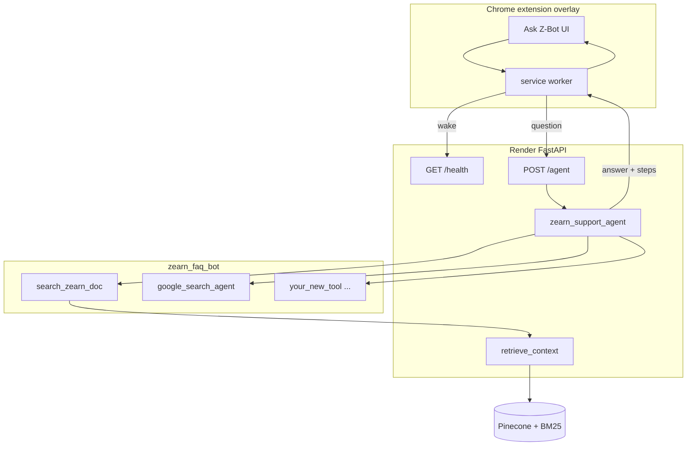

# Chrome Extension + Z-Bot Plan

**Status:** Phases 1–5 complete for the extension track (MVP → polish → harden → package → publish prep). Chrome Web Store **upload** remains a human step.

**Last updated:** 2026-08-05

**Prerequisite:** RAG + Google Search fallback — **COMPLETE**. Backend shipped through commit [`00f5ad7`](https://github.com/angyb/AI-Internship/commit/00f5ad7) (retrieval hardening + honest eval; RAG feature-complete at [`161bc16`](https://github.com/angyb/AI-Internship/commit/161bc16)).

**Related docs:** [`zearn-support-agent-summary.md`](zearn-support-agent-summary.md) · [`rag-summary.md`](rag-summary.md) · [`README.md`](README.md) · extension [`../chrome-extension/README.md`](../chrome-extension/README.md) · **cloud handoff** [`../chrome-extension/ask-zbot-cloud-handoff.md`](../chrome-extension/ask-zbot-cloud-handoff.md)

---

## Build todos

| ID | Task | Status |
|----|------|--------|
| `verify-api` | Confirm Render `POST /agent` returns `{ answer, steps }` and `GOOGLE_API_KEY` is set | done |
| `scaffold-extension` | Create `../chrome-extension/` with MV3 manifest, content script matches for `*.zearn.org`, service worker | done |
| `overlay-ui` | Shadow DOM overlay: Ask Z-Bot pill, question input, markdown answer (Sources links), collapsible Think/Act/Observe steps | done |
| `api-proxy` | Background worker: `POST /agent` via `chrome.runtime.sendMessage`; 120s timeout; configurable `AGENT_API_URL`; surface FastAPI `detail` on errors | done |
| `fallback-banners` | Web-fallback banner when answer contains `FALLBACK_PREFIX` or `google_search_agent` in steps; refusal banner on corpus miss | done |
| `cold-start-mvp` | Wake `GET /health` before first `/agent`; show "Waking up API…" copy (Render free tier) | done |
| `cors-optional` | Add FastAPI CORS middleware for chrome-extension origins (optional if proxy-only) | skipped (proxy-only; no CORS needed) |
| `dev-readme` | Document load-unpacked workflow + how to add a new tool under `zearn_faq_bot/tools/` | done |
| `phase2-settings` | Full settings panel: API URL override, reset-to-default, health check, shortcut hint | done |
| `phase2-shortcut` | Keyboard shortcut `Alt+Z` to toggle Ask Z-Bot | done |
| `phase2-styling` | Zearn-adjacent styling (help center colors/fonts) | done |
| `phase3-auth` | Optional `AGENT_API_KEY` gate on `POST /agent` (X-API-Key / Bearer) | done |
| `phase3-rate` | Sliding-window rate limit per `X-Install-Id` or IP | done |
| `phase3-privacy` | In-extension privacy policy + Settings link | done |
| `phase3-telemetry` | Opt-in client error telemetry (`POST /telemetry`, server flag) | done |
| `phase4-package` | `scripts/package.sh` → `dist/ask-zbot-*.zip` + store listing draft | done |
| `phase4-docs` | Extension README, publish checklist, screenshots folder | done |
| `phase5-v1` | Bump to v1.0.0 + publish checklist for Web Store human submit | done |
| `harden-later` | _(superseded by phase3–5)_ | done |

---

## Naming

| What | Name | Notes |
|------|------|-------|
| **Extension UI label** | **Ask Z-Bot** | Pill/button text in the overlay |
| **Streamlit / page title** | **Zearn Support Agent** | Not "Teacher" |
| **Tools package** | **`zearn_faq_bot/`** | Colocated in `rag-vector-databases/` |
| **ADK agent** | **`zearn_support_agent`** | Unchanged |
| **Primary tool** | **`search_zearn_doc`** | Hybrid RAG retrieval (in-process on API) |
| **Fallback tool** | **`google_search_agent`** | ADK Agent-as-Tool |
| **API endpoint** | **`POST /agent`** | Not `/ask` |

---

## Current state

| Layer | Status | Key files |
|-------|--------|-----------|
| Documents | Scraped | [`../documents/website/`](../documents/website/), [`../documents/zendesk/`](../documents/zendesk/) |
| Vector store | **Pinecone** + in-process BM25 | [`ingest.py`](ingest.py), [`bm25_index.py`](bm25_index.py) — **16,364** chunks; BM25 rebuilt from Pinecone on API startup |
| Ingest metadata | PDF + markdown titles | Native `title` + `source_url` on every chunk; PDF titles from filename heuristics + `PDF_TITLE_OVERRIDES` in [`ingest.py`](ingest.py), suffixed with `(PDF)` |
| Retrieval API | Deployed | [`main.py`](main.py) — `POST /retrieve`, `/ask`, `/eval`, **`/agent`** |
| **Z-Bot (ADK agent)** | Built | [`zearn_faq_bot/`](zearn_faq_bot/) + shim [`zearn_support_agent.py`](zearn_support_agent.py) |
| Agent UI reference | Built | [`zearn_streamlit_app.py`](zearn_streamlit_app.py) — **port UX from here** |
| Golden-set eval | **6 questions** | [`golden_set.json`](golden_set.json) + [`eval_golden.py`](eval_golden.py) |
| Render API | Live | `https://ai-internship-i3lw.onrender.com` (`week-2-rag-api` in [`render.yaml`](render.yaml)) |
| Render UI | Live | `https://zearn-faq-bot.onrender.com` (`zearn-agent-ui`; `AGENT_API_URL` → API above) |
| **Chrome extension** | **v1.1.0 — Profile tab (Week 5 memory)** | [`../chrome-extension/`](../chrome-extension/) — Profile save/recall/forget via `/memory`; Trace tab runs `/eval-agent` |

### Not used by the extension or agent

- **`rag_vector_db/`** — legacy local Chroma from the bootcamp notebook only. Moved **outside** `rag-vector-databases/` (not part of this project). Production retrieval uses **Pinecone**, not Chroma. No extension work depends on it.

### Shipped in recent commits

| Commit | Change |
|--------|--------|
| `cea3b7d` | Consolidated agent into week-2; Google Search fallback |
| `f8a2ba5` | Extracted `zearn_faq_bot/` package; empty Streamlit search field |
| `3052d76` | Agent cites Sources as markdown links; Pinecone + frontmatter enrichment |
| `c20ca87` | Removed duplicate Streamlit source block — answer text is sole citation UI |
| `161bc16` | PDF titles from filenames + overrides; golden set → 6 questions; README / rag-summary / agent summary / this plan |
| **`00f5ad7`** | Retrieval speed/concurrency hardening (cached clients, thread locks, single rerank pass, batched neighbor fetch); honest open-corpus eval hit; `env_utils`; `RETRIEVAL_FETCH_K` → 20 |

### Backend details the extension inherits

- **Sources in answer only:** The agent writes a `Sources:` section with markdown links (`[Title](url)`) in the final answer. Do **not** add a second source list from Observe-step JSON — removed from Streamlit in `c20ca87` ([`zearn_streamlit_app.py`](zearn_streamlit_app.py) lines 177–192).
- **PDF link labels** include `(PDF)`, e.g. `[Zearn Account Comparison (PDF)](https://drive.google.com/...)`.
- **Observe steps** still include a `sources` array in JSON (optional raw-step panel); user-facing citations live in `answer`.
- **`search_zearn_doc`** returns `title`, `source_url`, `document_id` per chunk from Pinecone ([`zearn_faq_bot/tools/search_zearn_doc.py`](zearn_faq_bot/tools/search_zearn_doc.py)).
- **Agent model:** `GEMINI_MODEL` env (default `gemini-flash-latest`); `MAX_LLM_CALLS=15`.
- **No CORS middleware** on FastAPI — service-worker proxy is the path used by the extension (Phase 1 skipped CORS).
- **Retrieval config (`00f5ad7`):** `RETRIEVAL_FETCH_K=20` (local `.env` + [`render.yaml`](render.yaml)) widens the candidate pool so borderline-relevant chunks surface. Local cross-encoder rerank is **on** (`RERANK_ENABLED=true`) but stays **off on Render** (512MB limit) — so `/agent` answers the extension sees are hybrid-retrieval-only, without local reranking.
- **Retrieval internals hardened (`00f5ad7`):** cached Pinecone/embeddings clients, thread-locked BM25 index + cross-encoder singleton, a single cross-encoder scoring pass, and batched neighbor fetches. Transparent to the extension — lower `/agent` latency and safe under concurrent requests. **No re-ingest required** (embedding model, chunk size/overlap, and stored metadata are unchanged).
- **Re-ingest:** Only when you intentionally refresh Pinecone (chunk/title logic changes). Confirm before running against the shared production index.

### Latest golden-set eval (local API, rerank on, 2026-08-05)

Run: `python eval_golden.py` from this folder (API mode against local `uvicorn` with `RERANK_ENABLED=true`, `RETRIEVAL_FETCH_K=20`).

| Metric | Score |
|--------|-------|
| retrieval_hit | 100.00% (6/6) |
| faithfulness | 0.8417 |
| answer_correctness | 0.6639 |

**Metric change (`00f5ad7`):** `retrieval_hit` is now measured on **open-corpus** retrieval — the eval no longer passes `expected_document_ids` as a retrieval filter, so the number reflects the real retriever rather than an oracle. Local cross-encoder rerank (30 candidates) + `fetch_k=20` recovered "How has Zearn incorporated the science of learning…", which missed under the old dense-only top-10 (its best chunk sat at ~rank 11).

**Render caveat:** the deployed `/agent` runs with rerank **off** (512MB) but now also uses `fetch_k=20`. Extension answers come from Render, so expect its retrieval to differ from these locally-reranked numbers; a wider `fetch_k` is the main open-corpus recall lever available there.

Weakest answer: **"How do I add students to my class?"** (faithfulness 0.50). Extension surfaces the same agent behavior; improving that is a separate prompt/retrieval task.

---

## Architecture



**Why `POST /agent` not `/ask`:** Full agent loop — multi-step retrieval, Google Search fallback, Think/Act/Observe logs. New tools under `zearn_faq_bot/tools/` work after API redeploy with no extension changes.

---

## API contract (`POST /agent`)

Defined in [`main.py`](main.py) (`AgentRequest`, `AgentResponse`, `AgentStep`).

**Request:**
```json
{ "question": "How many students can I add to my class?" }
```

**Response:**
```json
{
  "answer": "Teachers with a free Individual Account can add up to 35 students.\n\nSources:\n- [Add students to your class](https://help.zearn.org/...)\n- [Zearn Account Comparison (PDF)](https://drive.google.com/...)",
  "steps": [
    { "phase": "Think", "author": "zearn_support_agent", "text": "..." },
    { "phase": "Act", "author": "zearn_support_agent", "tool": "search_zearn_doc", "args": { "question": "..." } },
    { "phase": "Observe", "author": "zearn_support_agent", "tool": "search_zearn_doc", "result": "{ \"chunk_count\": 1, \"sources\": [{\"title\": \"...\", \"source_url\": \"...\"}] }" }
  ]
}
```

**Client timeouts:** 120s (`AGENT_TIMEOUT_MS`). First Render request after idle may take up to ~60s — call `GET /health` first with the same timeout budget.

**Errors:** On HTTP 500, FastAPI returns `{ "detail": "..." }` (e.g. missing `GOOGLE_API_KEY`, agent failure). Surface `detail` in the overlay — do not fail silently.

**Fallback / refusal detection** — mirror [`zearn_streamlit_app.py`](zearn_streamlit_app.py):

```python
# Web fallback
FALLBACK_PREFIX in answer or any(
    step.get("tool") in ("google_search_agent", "google_search")
    for step in steps
)

# Corpus refusal
not web_fallback and (
    not answer.strip()
    or answer.strip() == REFUSAL_MESSAGE
    or "couldn't find that in the zearn documentation corpus" in answer.lower()
)
```

Constants: [`zearn_faq_bot/constants.py`](zearn_faq_bot/constants.py).

---

## Streamlit UX to port (reference implementation)

[`zearn_streamlit_app.py`](zearn_streamlit_app.py) is the canonical UI spec:

| Streamlit behavior | Extension equivalent |
|--------------------|---------------------|
| Empty question placeholder (`"Ask a Zearn support question..."`) | Empty input on open — no prefilled question |
| Steps **above** final answer | Collapsible Think/Act/Observe panel above answer |
| `st.markdown(answer)` — Sources links in answer body | Render answer markdown to HTML; **no second source block** |
| `st.info("Not found in Zearn docs — sourced from the web")` | Yellow fallback banner |
| `st.warning("Not found in corpus")` | Refusal banner |
| Cold-start spinner copy | "Running agent… first request may take up to a minute while the API wakes up." |
| Raw step JSON expander | Optional "Raw step data" collapsible (dev-friendly) — deferred past MVP |

Default hosted API: `https://ai-internship-i3lw.onrender.com`.

---

## Repo structure

```
AI-Internship/
  ai-engineering-bootcamp-v2/week-2/
    documents/                  # corpus (untouched by extension)
    scrapers/
    rag-vector-databases/       # FastAPI + agent + Streamlit (you are here)
      zearn_faq_bot/
      zearn_support_agent.py
      zearn_streamlit_app.py
      main.py
      ingest.py                 # PDF_TITLE_OVERRIDES, humanize_pdf_document_id()
      golden_set.json
      chrome-extension-plan.md  # this file
      zearn-support-agent-summary.md
    chrome-extension/           # Phases 1–5 complete (v1.0.0)
      manifest.json             # commands.toggle-zbot (Alt+Z)
      background.js             # /agent proxy + API key + install ID + telemetry
      content.js
      overlay.css               # Zearn-adjacent coral/navy palette
      overlay.js                # settings: URL, API key, privacy opt-in
      config.js
      privacy-policy.html
      store-listing.md
      PUBLISH_CHECKLIST.md
      scripts/package.sh
      vendor/marked.min.js
      icons/
      README.md

  rag_vector_db/                # OUT OF PROJECT — notebook Chroma only (optional, local)
```

No re-architect required. Extension is standalone JS; only needs `POST /agent` (+ optional `GET /health` wake-up).

---

## Phase 1 — Overlay MVP ✅ DONE

### 1. Scaffold (`../chrome-extension/`) — done

**`manifest.json` (MV3):**
- `manifest_version: 3`
- `permissions`: `storage` (API URL override)
- `host_permissions`: Render API + `http://127.0.0.1:8000/*` + `http://localhost:8000/*`
- `background.service_worker`: `background.js`
- `content_scripts`: `*://*.zearn.org/*`, `*://zearn.org/*`; `run_at: document_idle`
- Primary entry: in-page **Ask Z-Bot** pill

### 2. Background service worker (`background.js`) — done

- `GET /health` on first expand (wake Render)
- `chrome.runtime.onMessage` → `{ type: "ask" | "wake" | "getApiBase" }`
- 120s `AbortController` timeout on `/agent`; 60s on `/health`
- Returns `{ answer, steps }` or `{ error }` with FastAPI `detail` when present
- No API keys in extension

### 3. Content script + overlay — done

- Collapsed floating pill; expanded panel with input, Ask, steps, answer, minimize
- Shadow DOM style isolation
- No chat history in v1
- Vendored `marked` under `vendor/`; Sources rendered from answer markdown only

### 4. Config (`config.js`) — done

Plain globals on `self.ZBOT_CONFIG` (no ES modules — vanilla load-unpacked). Override via `chrome.storage.sync`.

### 5. CORS — skipped

Service-worker proxy avoids CORS. No `CORSMiddleware` added to FastAPI.

### Phase 1 decisions (from build session)

- Vanilla JS, no bundler
- `marked` only (link hardening: `target=_blank` + `rel=noopener noreferrer`); DOMPurify deferred
- `/health` wake on pill-expand
- Minimal API-URL field in overlay (expanded to full settings in Phase 2)
- Raw-step JSON panel deferred

---

## Local dev workflow (extension testing)

```bash
# Terminal 1 — API
cd ai-engineering-bootcamp-v2/week-2/rag-vector-databases
source .venv/bin/activate
uvicorn main:app --host 127.0.0.1 --port 8000

# Terminal 2 — compare against Streamlit (optional)
AGENT_API_URL=http://127.0.0.1:8000 streamlit run zearn_streamlit_app.py

# Chrome — load unpacked ../chrome-extension/
# Set AGENT_API_URL to http://127.0.0.1:8000 in extension settings panel
```

Quick API smoke test:

```bash
curl -s -X POST http://127.0.0.1:8000/agent \
  -H "Content-Type: application/json" \
  -d '{"question":"What causes a Tower Alert?"}' | jq '{answer: .answer[0:200], step_tools: [.steps[].tool]}'
```

---

## Phase 2 — Polish ✅ DONE

- [x] Phase 1 MVP (see above)
- [x] **Settings panel** — gear icon + expandable Settings: API URL Save / Reset to default, health Check now, Alt+Z + timeout hints (`chrome.storage.sync`)
- [x] **Keyboard shortcut** — `Alt+Z` via `commands.toggle-zbot` → background → content-script `toggle()`
- [x] **Zearn-adjacent styling** — coral CTA (`#FF5A36`), navy text, warm surface, Nunito Sans stack; answer/steps restyled to match

---

## Phase 3 — Harden ✅ DONE

- [x] **API key auth** — `AGENT_API_KEY` env; when set, `POST /agent` requires `X-API-Key` or `Authorization: Bearer` ([`agent_security.py`](agent_security.py)). Unset = open (dev-friendly).
- [x] **Rate limiting** — sliding window per `X-Install-Id` (extension) or client IP; `AGENT_RATE_LIMIT_PER_MINUTE` (default 20).
- [x] **Privacy policy** — [`../chrome-extension/privacy-policy.html`](../chrome-extension/privacy-policy.html) + Settings link.
- [x] **Optional telemetry** — extension opt-in → `POST /telemetry` when `TELEMETRY_ENABLED=true` (no question text).
- [x] Extension Settings: API key field; Streamlit remote sends `AGENT_API_KEY` when set.
- [x] Unit tests: [`test_agent_security.py`](test_agent_security.py).

---

## Phase 4 — Package & docs ✅ DONE

Defined as packaging/QA/docs (not in the original 3-phase sketch):

- [x] [`../chrome-extension/scripts/package.sh`](../chrome-extension/scripts/package.sh) → `dist/ask-zbot-<version>.zip`
- [x] [`../chrome-extension/store-listing.md`](../chrome-extension/store-listing.md) — Store listing draft + permission justifications
- [x] [`../chrome-extension/screenshots/README.md`](../chrome-extension/screenshots/README.md) — screenshot checklist
- [x] Extension README updated for auth/packaging

---

## Phase 5 — Publish readiness ✅ DONE

Defined as v1.0.0 + human submit checklist:

- [x] Manifest / config version **1.0.0**
- [x] [`../chrome-extension/PUBLISH_CHECKLIST.md`](../chrome-extension/PUBLISH_CHECKLIST.md)
- [ ] **Human:** host privacy policy at a public https URL; upload zip to Chrome Web Store when authorized
- [ ] **Human:** replace placeholder icons / capture Store screenshots

---

## Tool development workflow

Canonical instructions (read these when adding a tool):
[`zearn_faq_bot/ADDING_A_TOOL.md`](zearn_faq_bot/ADDING_A_TOOL.md)

Also wired for agents via:
- Skill: `.cursor/skills/add-zearn-agent-tool/`
- Rule: `.cursor/rules/zearn-agent-tools.mdc` (globs `zearn_faq_bot/**`)

1. Add `zearn_faq_bot/tools/<snake_name>.py` (see `search_zearn_doc.py` — `my_tool.py` was only a placeholder name)
2. Register in [`zearn_faq_bot/agent.py`](zearn_faq_bot/agent.py)
3. Redeploy Render API (`week-2-rag-api`)
4. Extension picks up new capability automatically — no extension code changes

---

## Suggested build order

1. ~~Prerequisite: RAG + Google Search fallback~~ **DONE**
2. ~~Verify `POST /agent` on Render~~ **DONE**
3. ~~Pinecone metadata: `title` / `source_url`; PDF filename titles~~ **DONE** (`161bc16`)
4. ~~Fix duplicate Sources UI in Streamlit~~ **DONE**
5. ~~Project docs (README, summaries, this plan)~~ **DONE**
6. ~~Scaffold `chrome-extension/` + MV3 manifest~~ **DONE**
7. ~~Background worker → health wake + `POST /agent` + error `detail`~~ **DONE**
8. ~~Shadow DOM overlay — pill, input, bundled markdown, step log~~ **DONE**
9. ~~Fallback/refusal banners (copy Streamlit logic exactly)~~ **DONE**
10. ~~`README.md` — load unpacked, local vs Render API~~ **DONE**
11. Manual test matrix on `help.zearn.org` + `zearn.org`
12. ~~Phase 2 polish (`Alt+Z`, full settings, Zearn-adjacent styling)~~ **DONE** (v0.2.0)
13. ~~Phase 3 hardening (auth, rate limits, privacy, telemetry)~~ **DONE**
14. ~~Phase 4 packaging + store listing draft~~ **DONE**
15. ~~Phase 5 v1.0.0 publish checklist~~ **DONE** (Store upload is human)

---

## Manual test matrix (extension MVP)

| Question | Expected |
|----------|----------|
| "What causes a Tower Alert and what is its purpose?" | `search_zearn_doc` in steps; Sources links in answer; no fallback banner |
| "What's the weather in New York?" | `google_search_agent` in steps; fallback banner; answer starts with `FALLBACK_PREFIX` |
| "How many students can I add to my class?" | Answer with Sources; links open help.zearn.org or PDF URLs; **one** source list only (in answer) |

Compare side-by-side with Streamlit at `https://zearn-faq-bot.onrender.com`.

**Phase 2 checks:** `Alt+Z` toggles the panel; Settings shows API URL / health / reset; overlay uses coral-navy Zearn-adjacent styling.

**Phase 3 checks:** With `AGENT_API_KEY` set, missing key → 401; over rate limit → 429; privacy link opens; telemetry opt-in only.

**Phase 4–5 checks:** `./scripts/package.sh` produces zip; follow `PUBLISH_CHECKLIST.md` before any Store submit.

---

## Success criteria for MVP

- User on `zearn.org` or `help.zearn.org` opens **Ask Z-Bot** and gets an answer via `/agent`
- Render cold-start handled (`/health` wake + user-facing wait copy)
- Answer renders markdown Sources links — **no duplicate source block** from Observe JSON
- Think/Act/Observe steps visible above the answer (matching Streamlit layout)
- Web fallback and corpus refusal banners match Streamlit
- API errors show FastAPI `detail`, not a blank failure
- New tools under `zearn_faq_bot/tools/` work after API redeploy — no extension changes
- No API keys exposed in extension bundle
